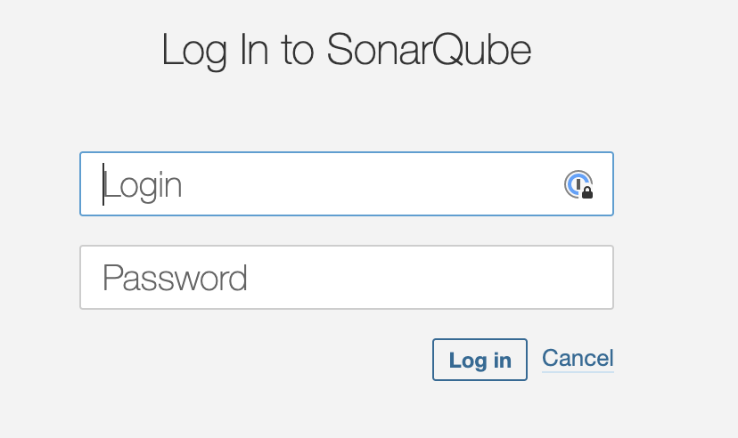
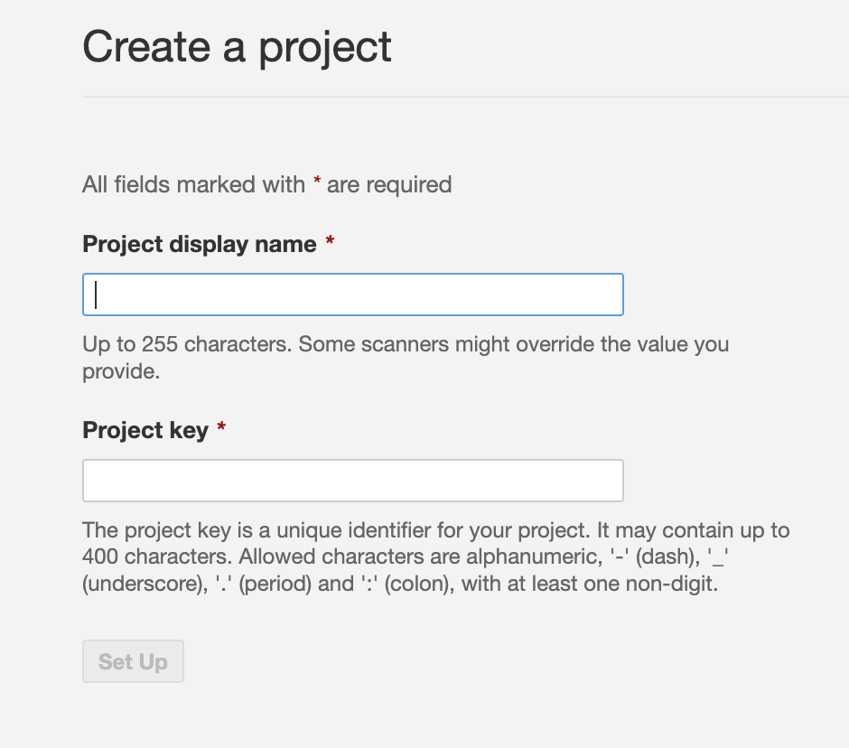
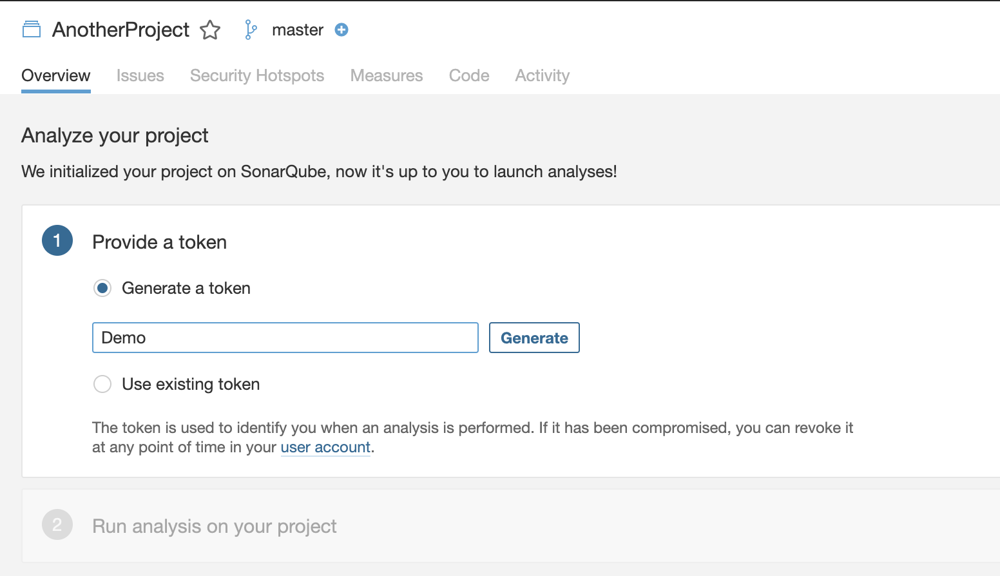
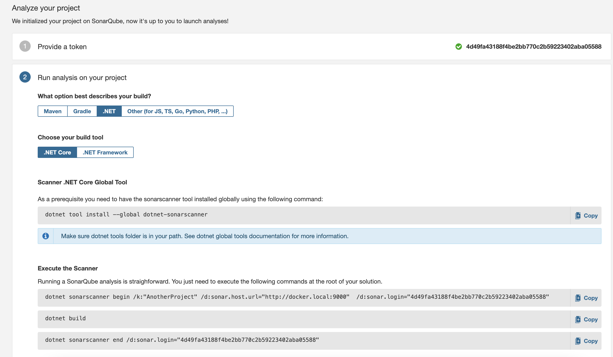
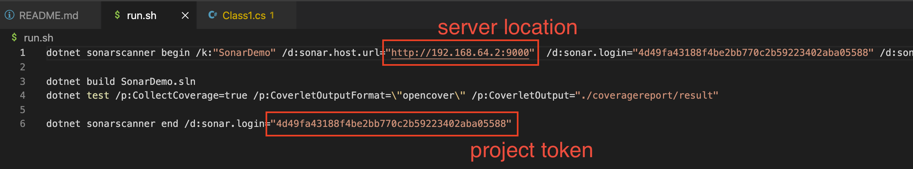
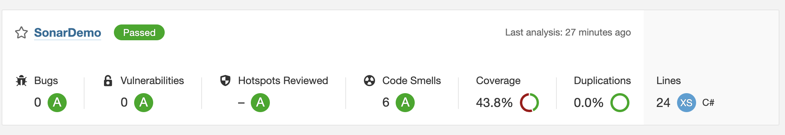

# TODO

## Create a sonarqube server

docker run -d --name sonarqube -p 9000:9000 sonarqube:9.3-community

http://docker.local:9000

## Login with admin/admin and change a password

## Create a project(this will need for uploading a codecoverage)

## Copy a token(this will need for uploading a codecoverage)

## Download tool for uploading a codecoverage

dotnet tool install --global dotnet-sonarscanner

## Update the run.sh

## Open the project
http://docker.local:9000/dashboard?id=SonarDemo